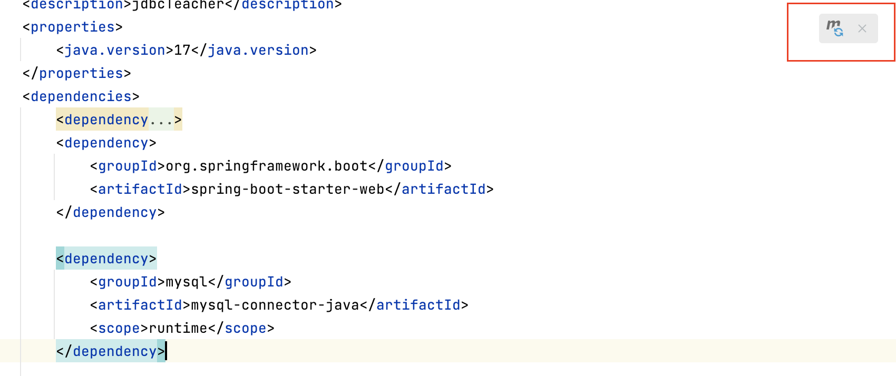
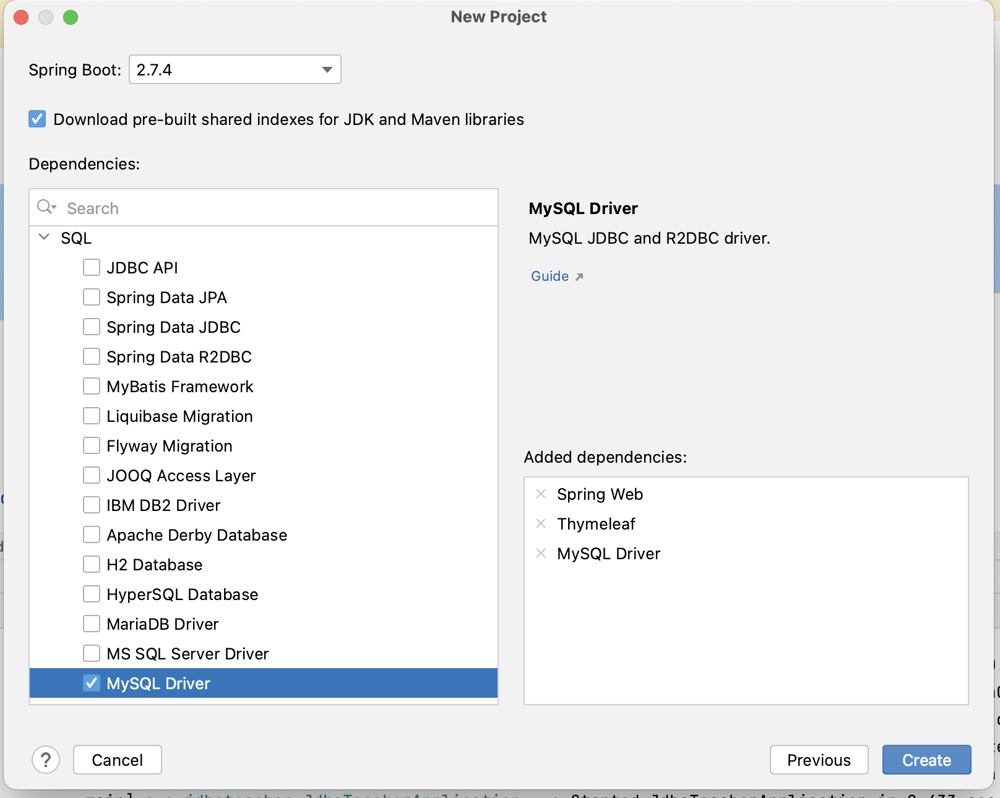

# Læringsmål
* Forbind en spring boot webapplikation med en mysql database.
* Læse fra en tabel i databasen og ligge resultatet i en List<> og vise resultatet i browseren vha. @RestController.

# Materiale


# Kode fra sql undervisningen 


## Forbind Spring Boot og database

```
public class DatabaseConnectionManager {
    private static String hostname;
    private static String username;
    private static String password;
    private static Connection conn;

    public static Connection getConnection(){
        if(conn != null){
            return conn;
        }

        hostname = "jdbc:mysql://clbodat22v1.mysql.database.azure.com/pokedex";
        username = "clbo";
        password = "Keapassword";

        try {
            conn = DriverManager.getConnection(hostname, username, password);
        } catch (SQLException e) {
            e.printStackTrace();
        }

        return conn;
    }
}
```
## Læs data fra Databasen
I dette eksempel læses alle students fra databasen og tilføjes en Liste som returneres til servicelaget eller controller.

```
public class StudentRepository {

    private Connection conn = DatabaseConnectionManager.getConnection();

    // Get all students fron the database
    public List<Student> getAllStudents(){

        List<Student> students = new ArrayList<>();

        try {
            PreparedStatement  psts = conn.prepareStatement("SELECT * FROM students");
            ResultSet resultSet = psts.executeQuery();

            while(resultSet.next()){
                students.add(new Student(
				resultSet.getInteger("id"),
				resultSet.getString("name"),
				resultSet.getString("cpr")	
				)
            }

        } catch (SQLException e) {
            throw new RuntimeException(e);
        }

        return students;
    }
```

I dette eksempel SELECTES der en studerende baseret på det id der kommer med somparameter i metoden.

```

    // Get one student based on the id
    public Student getStudent(int id){
		
        try {
            PreparedStatement  psts = conn.prepareStatement("SELECT * FROM students WHERE id = ?");
	    psts.setInt(1, id); 
            ResultSet resultSet = psts.executeQuery();

           if(resultSet.next()){
                return new Student(
				resultSet.getInteger("id"),
				resultSet.getString("name"),
				resultSet.getString("cpr")	
				)
	    }
	    
        } catch (SQLException e) {
            throw new RuntimeException(e);
        }

	return null;

    }

}
```


 
<!--
### Generer et dump af din database

```
	$ mysqldump --opt -u [uname] -p [pass] [dbname] > [backupfile.sql]
```
-->

#  Øvelser

## Movie Workshop, (nu med Database)

[Løsningsforslag]()    

Du skal i denne opgave arbejde videre på [MovieWorkshop projektet](https://clbo.gitbook.io/2_semester_kompendie/spring-introduction-2/ex-movie-facts-workshop). 
Du kan endte bruge din egen, eller klone [denne version](https://github.com/2-semester-programmering/Ex_movieWorkshop.git) og bruge den som udgangspunkt for denne øvelse. 

### MySQL Driver dependency
Copy/paste dette ind i din pom.xml fil.

```
        <dependency>
            <groupId>mysql</groupId>
            <artifactId>mysql-connector-java</artifactId>
            <scope>runtime</scope>
        </dependency>
```
Husk at klikke på dette icon for at downloade og integrere denne dependency i dit projekt.



Du kunne også have afkrydset **MySql Driver** under dependencies da du oprettede projektet. 



## Læs Data fra Database i stedet for excell
Øvelsen går nu ud på at læse data fra en database i stedet for fra et excellark. 

Så det førte du skal gøre er at lave en ny klasse og kald den MovieDBRepository. I denne fil skal du have de samme metoder som i MovieRepository, men data skal læses fra en database i stedet for excell. 


